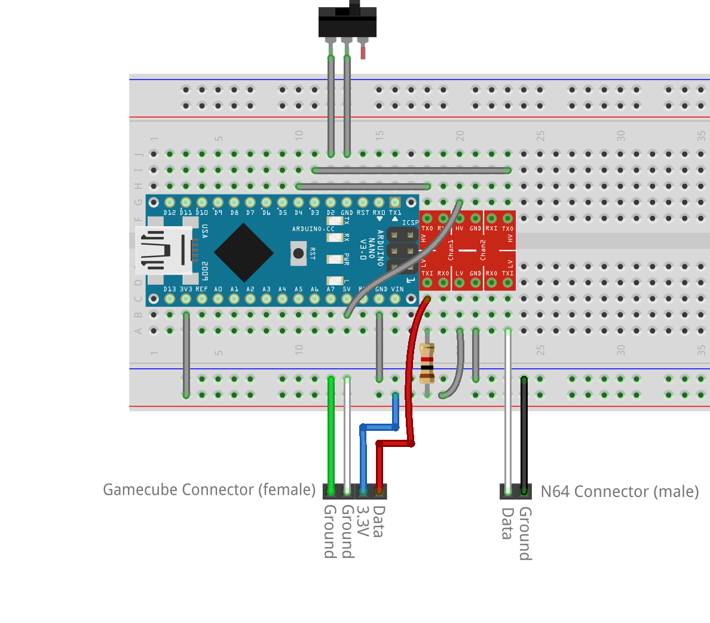

# GC to N64 Adapter
Arduino firmware to adapt a Gamecube controller for use on a Nintendo 64.

This was primarily made so I could use a "virtual console" like deadzone on
N64, and toggle it quickly with a physical switch on the adapter.
Certain games are easier to play with a deadzone, such as Paper Mario
requiring a neutral analog stick for consecutive jumps. An interesting side
effect is that cardinal inputs inside the deadzone will be perfectly straight,
which can produce consistent movement despite the garbage movement mechanics
in Majora's Mask.

It also functions as an input display over usb.
This requires a fork of NintendoSpy due to timing issues. 
https://github.com/ClydePowers/NintendoSpy-1/releases

## Building
The only prerequisite is installing the Nintendo library by Nicohood from the
library manager. This library requires a 16MHz clock speed.

## Hardware

I'm not super experienced with electronics, there's probably an easier or
cheaper way of doing this.
