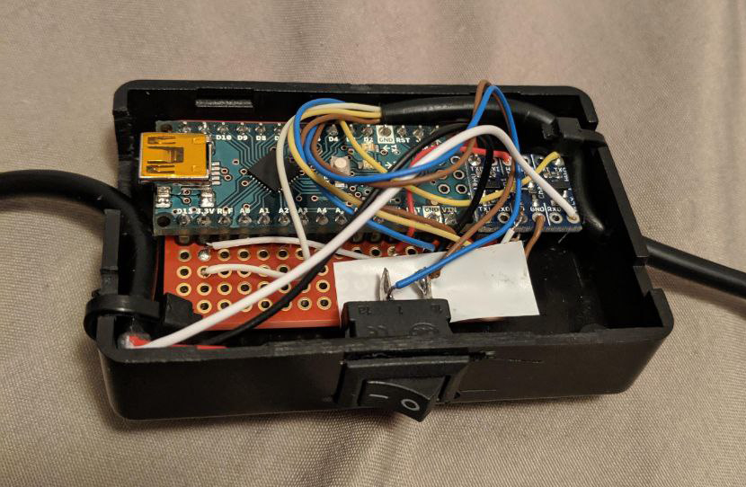

# GC to N64 Adapter

Arduino firmware to adapt a Gamecube controller for use on a Nintendo 64.

This was primarily made so I could use a "virtual console" like deadzone on
N64, and toggle it quickly with a physical switch on the adapter.
Certain games are easier to play with a deadzone, such as Majora's Mask or Paper Mario.

It also functions as an input display for use with NintendoSpy.

## Building
The only prerequisite is installing the Nintendo library by Nicohood from the
library manager. This library requires a 16MHz clock speed.

## Hardware

I'm not super experienced with electronics, there's probably an easier or
cheaper way of doing this.
